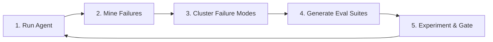

# AutoHarness Studio — Slide Presentation Deck

> **Presentation Topic:** AutoHarness Studio: Self-Improving Harness for Agentic Systems
> **Slides Format:** Title + Visual Asset / Screenshot Reference + Key Bullet Points + Narrator Notes.

---

## Slide 1 — AutoHarness Studio in One Sentence

### ✦ Headline
**“AutoHarness Studio: Self‑Improving Harness for Agentic Systems”**
*From failures ➜ evals ➜ safe promotions*

### ⚿ Visual Loop


### 🗎 Slide Details
- **Role:** AI Platform Engineer / Agent Evaluation Specialist
- **Mission:** Move agent engineering from "vibe-based" prompt tweaking to automated, data-driven, schema-validated safety checks.

---

## Slide 2 — The Problem with Agents Today

### ✦ Headline
**“Agents Fail Quietly, Eval Layers Lag Behind”**

### 🗎 Key Points
- **Silent Failures:** Errors are buried deep in multi-step trajectories. The same regressions recur release after release.
- **Ad-Hoc Testing:** Evaluations are spot-checks on synthetic prompts, failing to represent production task distributions.
- **"Vibe-Based" Deployments:** Harness versions are promoted by developers manually inspecting a handful of logs rather than defensive, automated gates.

---

## Slide 3 — What AutoHarness Studio Does

### ✦ Headline
**“Turning Real Failures into Eval‑Driven Decisions”**

### ⚿ The Self-Improving Evaluation Loop
1. **Foundation Runs:** Run agents on Terminal-Bench containerized environments.
2. **Failure Mining:** Call local LLMs (JSON-mode) on failed tasks to produce schema-validated root cause diagnoses.
3. **Unsupervised Clustering:** Embed diagnosis text and cluster using HDBSCAN to find systematic failure patterns.
4. **Eval Generation:** Build targeted eval suites from representative cluster centroid failures.
5. **Scorecard Gating:** Compare candidate variants against the baseline and auto-promote only if guard rules clear.

---

## Slide 4 — Architecture at a Glance

### ✦ Headline
**“Production‑Style Stack, Minimal Dependencies”**

### ⚿ Technical Stack Comparison
| Component | Technology | Role |
| :--- | :--- | :--- |
| **Harness & Benchmark** | Harbor + Terminal‑Bench | Containerized task execution & verifiers |
| **Backend & Jobs** | FastAPI + SQLite / SQLAlchemy | API routing, HDBSCAN clustering, replay engine |
| **Local Intelligence** | Local `llama.cpp` server | Embeddings & schema-validated chat completions |
| **Frontend Dashboard** | Next.js (TypeScript) | Visual decision tool with metrics drill-downs |

> **Pro-Tip:** All LLM calls are local (Llama-3.2-3B on port 8080) ➜ zero per-token API costs during evaluations.

---

## Slide 5 — From Run to Structured Failures

### ✦ Headline
**“Failure Mining: From Logs to Typed Labels”**

### 🖼 Visual (Run details and drawer)


### 🗎 Key Points
- **Trace Ingestion:** Automatically parse Harbor output into structured Runs, RunTasks, and TraceSteps.
- **One-Click Diagnosis:** Local LLM analyzes the final steps and trajectory to produce a structured JSON label.
- **Typed Metadata:** Extract taxonomy (`gap`, `tool_misuse`, `code_bug`), severity (`critical`, `high`), and readable explanations.

---

## Slide 6 — From Failures to Failure Modes

### ✦ Headline
**“Clustering Diagnoses into Failure Modes”**

### 🖼 Visual (Failure Modes Dashboard Grid)
```text
+-------------------------------------------------------+
|  Failure Mode: Missing numpy dependency               |
|  Count: 41 tasks  | Severity: Medium | Taxonomy: BUG   |
+-------------------------------------------------------+
|  Failure Mode: Incorrect command working directory    |
|  Count: 5 tasks   | Severity: Critical | Taxonomy: TOOL|
+-------------------------------------------------------+
```

### 🗎 Key Points
- **Semantic Clustering:** PCA + HDBSCAN clusters embedding vectors of the diagnosis text to find coherent failure patterns.
- **Automated Naming:** Prompts the LLM once per cluster to generate a concise title and description.
- **Impact-Prioritized:** Failure modes are ranked by impact (`count * severity_weight`), showing developers exactly what to fix first.

---

## Slide 7 — Eval Suites from Real Failure Modes

### ✦ Headline
**“Eval Suites Built Directly from Failure Modes”**

### 🖼 Visual (Eval Suite Details View)


### 🗎 Key Points
- **Living Safety Nets:** Selects representative tasks closest to the failure mode cluster centroid.
- **Dual-Mode Replays:** 
  - *Offline Replay:* Instantly pulls historic results from matching harness versions (extremely cheap).
  - *Online Rerun:* Triggers a narrow Harbor rerun restricted only to the suite's task subset.
- **Defensive Design:** Eval suites represent real-world failure distributions rather than synthetic prompt cards.

---

## Slide 8 — Experiments & Promotion Scorecard

### ✦ Headline
**“Experiments with Hard Eval Gates, Not Vibes”**

### 🖼 Visual (Promotion Scorecard Gating Grid)


### 🗎 Key Points
- **Intent-First Design:** Experiments define target deltas (improve failure modes) and guardrails (safety & regression limits).
- **Promotion Scorecard:** Side-by-side metric comparison table between baseline and candidate variants.
- **Deterministic Gates:** Automatically resolves variant status to `promoted` or `rejected` based on strict delta checks.

---

## Slide 9 — UX: Dashboards That Drive Action

### ✦ Headline
**“Designed as a Decision Tool, Not a Data Dump”**

### 🖼 Visual (Homepage overview)


### 🗎 Key Points
- **Glanceable KPI Cards:** Instantly communicates overall pass rate, delta changes, and guard suite alerts.
- **Calm, High-Contrast Accent Badge UI:** Restrains the color palette to neutral dark shades, utilizing colors only for critical outcomes (Green = Promoted/Pass, Red = Rejected/Fail).
- **Drill-Down Efficiency:** Moving from high-level trends to a specific task trace step takes under three clicks.

---

## Slide 10 — Why This Matters & What’s Next

### ✦ Headline
**“Small System, Big Pattern”**

### 🗎 Key Points
- **Closed Loop:** Bridges the gap between runtime failures and automated engineering guardrails.
- **Harness-Agnostic Core:** The database schemas and API controllers are generalizable to other agent frameworks beyond Terminal-Bench.
- **The Self-Improving Horizon:** The existing gating infrastructure is ready to receive an automated variant generator / proposer.

> **Closing line:** *“Failures become evals; evals gate promotions.”*
